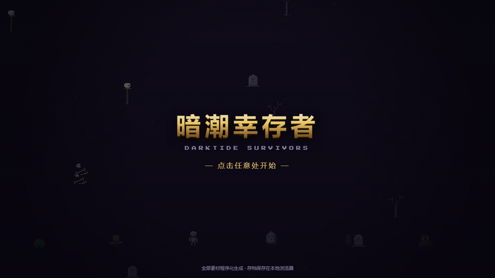

# ⚔️ 暗潮幸存者 · Darktide Survivors

[](https://darktide-survivors.vercel.app)
[]()
[]()
[]()

一款纯浏览器弹幕生存 Roguelite(类《吸血鬼幸存者》)。**零依赖、零构建、零后端**;所有像素美术与音乐都由代码实时生成,双击 `index.html` 即可游玩。



## 快速开始

- **在线试玩**:<https://darktide-survivors.vercel.app/>
- **本地运行**:直接双击 `index.html`,或在项目目录启动任意静态服务器:

```bash
python -m http.server 8000
# 浏览器打开 http://localhost:8000
```

## 怎么玩

- **移动**:WASD / 方向键(手机:屏幕虚拟摇杆)
- **攻击**:全自动,你只管走位
- **暂停**:ESC / P
- **目标**:活过 20 分钟,击败**暗潮魔王**

捡起蓝色经验晶升级,每次升级三选一构筑 Build;精英怪和 Boss 会掉落宝箱,**满级武器 + 对应被动 + 宝箱 = 进化**,进化出究极武器是后期清场的核心。

## 内容量

| 系统 | 数量 |
|---|---|
| 可解锁角色 | 6 名(骑士 / 法师 / 游侠 / 神官 / 狂战士 / 时行者) |
| 武器 | 12 种 × 8 级 + 12 种进化形态 |
| 被动道具 | 8 种 × 5 级 |
| 敌人 | 16 种小怪 + 精英化 + 4 个 Boss |
| 地图 | 3 张(幽暗墓园 / 血月荒野 / 深渊回廊,逐级解锁) |
| 永久成长 | 金币商店 14 项强化(可重置返还) |
| 成就 | 22 个(部分解锁角色 / 地图) |
| 其他 | 图鉴、无尽模式、本地存档、程序化芯片音乐 4 主题 |

## 技术实现

- 全部像素美术由 `js/sprites.js` 程序化生成(种子确定性,每次刷新一致)
- 音乐音效由 `js/audio.js` 用 WebAudio 实时合成(16 步音序器,强度分层)
- 对象池 + 空间哈希,同屏 400 敌人 + 1500 粒子稳定 60fps
- 存档保存在 `localStorage`(`darktide_save_v1`)
- 经典 `<script>` 全局命名空间,无 ES modules,`file://` 协议下也能直接运行
- 除 Google Fonts 外无任何外部资源请求,离线自动回退系统字体

## 项目结构

```text
darktide-survivors/
├── index.html          # 入口,按顺序加载各模块
├── css/
│   └── style.css       # 像素风样式与响应式布局
├── js/
│   ├── config.js       # 全部数值 / 数据表 / 文案
│   ├── sprites.js      # 程序化像素美术
│   ├── audio.js        # WebAudio 音效与芯片音乐
│   ├── fx.js           # 粒子 / 伤害数字 / 震屏
│   ├── engine.js       # 主循环 / 输入 / 相机 / 空间哈希
│   ├── meta.js         # 存档 / 商店 / 成就
│   ├── entities.js     # 玩家 / 敌人 / Boss / 拾取物
│   ├── weapons.js      # 武器 / 弹体 / 进化
│   ├── ui.js           # 全部界面(DOM)
│   └── main.js         # 状态机与启动
├── test/
│   └── headless.js     # 无头冒烟测试(模拟真实游玩)
└── SPEC.md             # 技术规范(模块接口与数据表)
```

## 开发校验

```bash
# 语法检查(PowerShell)
Get-ChildItem js -Filter *.js | ForEach-Object { node --check $_.FullName }

# 语法检查(Bash)
for f in js/*.js; do node --check "$f"; done

# 无头冒烟测试(模拟真实游玩约 160 秒)
node test/headless.js
```

## 版权与免责声明

本作是个人自制的**非商业同人项目**,与 Fatshark 或 Games Workshop 无任何隶属关系;游戏不包含任何官方素材,全部美术与音频均由代码生成。"Darktide" 等相关名称与设定归原权利方所有。
